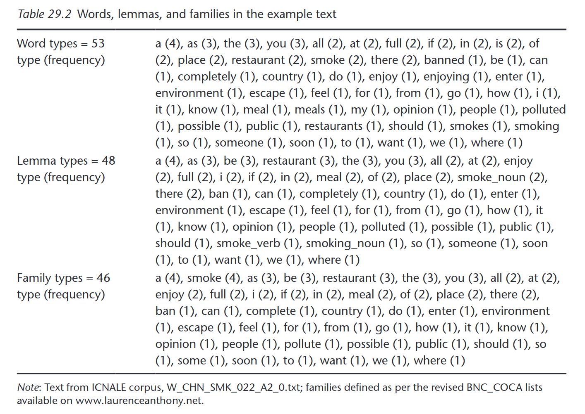
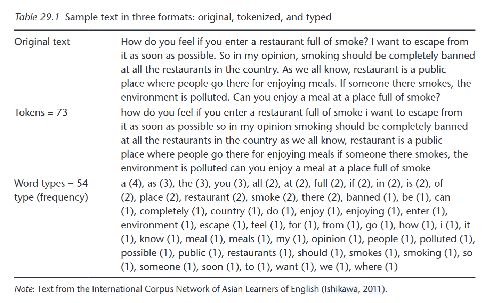

# Lexical richness

| Source |
| --- |
| Definitions, quotes and images are taken from: Kyle, Kristopher. “Measuring Lexical Richness.” In *The Routledge Handbook of Vocabulary Studies*. Routledge, 2019. |

> The term lexical richness was introduced by Yule (1944) to refer to **the number of words in a particular author’s vocabulary** (as evidenced by the words used in their published works). 
> subsequent researchers have used the term to refer to a number of different constructs, such as the propositional density of the words in a text (**lexical density**; Halliday, 1985; Linnarud, 1986; Lu, 2012; Ure, 1971), the diversity or variation of words in a text (**lexical diversity**; Malvern, Richards, Chipere, & Durán, 2004; McCarthy & Jarvis, 2007), and/or the proportion of difficult words in a text (**lexical sophistication**; Kyle & Crossley, 2015; Laufer & Nation, 1995; Meara, 2005). What connects the aforementioned constructs is the goal for which they are generally used, which is (broadly speaking) to **measure productive lexical proficiency**.

- **Tokens**: running words in a text.
- **Types**: unique words in a text.
- **Lemma**: group of words that share both semantics and part of speech. Thus, all inflected forms of a word are treated as members of the same lemma form (e.g., all inflections of the verb to smoke, including smoke, smokes, smoked, and smoking are members of the same lemma).
- **Function words** refer to closed-class, grammatical words such as articles and prepositions (among many others). **Content words** refer to open-class, lexical words, including nouns, adjectives, most verbs, and some adverbs.

Lexical items (basic unit for calculating lexical richness) can be words, lemmas, flemmas (no POS) and families (including derived forms).

<!-- flemmas and families are not included here, but are other options of lexical items -->

<!-- Lexical density: content (not function) words / total words. Useful for distinguish spoken vs written texts, as well as more or less interactive tasks. -->

<table>
	<tr>
		<td></td>
		<td></td>
	</tr>
</table>

### Lexical diversity

To measure the variety of lexical items in a text, which is presumed to reflect the extent of the lexical knowledge of the writer of that text.

To be considered:
- which lexical unit (words, lemmas, etc.),
- all lexical items or only content lexical items (no function) or only certain parts of speech (e.g. verbs and nouns),
- TTR (see below) is correlated with text length.

**Simple type-token ratio (TTR)**
- TTR = number of types / number of tokens

McCarthy and Jarvis (2010) analyzed a large corpus of written narrative and expository texts and found that TTR values tended to stabilize at a value of .720. [...] calculated using successive, non-overlapping text segments of at least ten words.

**Moving Average Type-Token Ratio (MATTR)**
- Average TTR value for all overlapping segments of the text of a specified length (e.g., 50 words).

**Practice**
Go to [this notebook](LexicalDiversity.ipynb) to try it out.

### Lexical sophistication

> the “number of low frequency words that are appropriate to the topic and style of writing” (Read, 2000, p. 200). This definition highlights the importance that reference-corpus frequency has played in defining the construct.

> **frequency** is measured by comparing the lexical items in a written or spoken text with their frequency in a reference corpus. [... Example of reference corpora:] British National Corpus (BNC Consortium, 2007) and the Corpus of Contemporary American English (COCA; Davies, 2010).

# Homeworks

### 1
Attention: If you don't know what a relative or absolute path is, you can find various online resources that explain it (e.g. https://phoenixnap.com/kb/absolute-path-vs-relative-path, https://www.geeksforgeeks.org/operating-systems/path-name-in-file-directory/). If you still have doubts, please let me know and we can look into it in class.

Open the notebook file 'LexicalDiversity.ipynb'. Add new cells to calculate TTR and MATTR for the three works in our corpus and for the three texts you know well. Save it as 'YourSurname_LexicalDiversity.ipynb'.Upload this notebook file to ILIAS.

Attention:
- There is a comment in the code indicating where you have to change the PATH to point to the txt files of the three novels; this is the only change needed in the code.
- If you want to upload your files to mybinder, use the Upload button (top left). You don't need to upload the additional txt files to ILIAS.

### 2	 
Read: Underwood, Ted. “Algorithmic Modeling: Or, Modeling Data We Do Not yet Understand.” In *The Shape of Data in Digital Humanities*. Routledge, 2018. [in ILIAS. Find two links with previous readings]